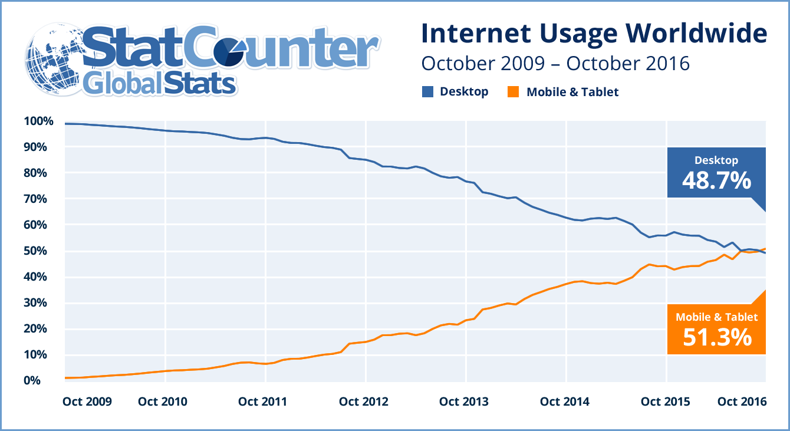

# CSS Grids
_Outline:_
* Intros
* A Brief History of CSS Layout
	* Floats
	* THE HORROR: tables!!
	* ##-column + ____px grid systems
		* 12-column, 16, 18 layouts
		* 960px, 1000px grid, 1200px grid system
	* frameworks, bootstrap, skeleton, foundation
		* parents / containers, children = grid
	* MOBILE: 
		* mobile-first due to proliferation of mobile screens around the birth of iPhone in 2006
		* Adaptive to Responsive / Progressive Enhancement v Graceful Degradation
		* media queries, 2008-2009
		* “mobile first” 2009
		* “Responsive” termed 2010-2011
	* Semantic HTML & CSS Grid (& Flexbox)
* Demo CSS Grids Part 1, Basics
* Demo CSS Grids Part 2,  Grid Areas + Responsive
* Hands-on Exercise: Pick a grid, any grid:
	* [The 892 unique ways to partition a 3 x 4 grid](http://www.dubberly.com/concept-maps/3x4grid.html)

	<a href='3x4variations-poster.pdf'>3x4variations-poster.pdf</a>


### Examples of CSS Grids in the wild:
* Comic Strip CodePen:
 [CSS Grid Layout and Comics (as Explained by Barry the Cat)](https://codepen.io/tutsplus/pen/pNgZpj/)
* Wim Crouwel’s Calendar:
 [Wim Crouwel’s Calendar (CSS Grid)](https://codepen.io/droom/pen/KmwxGj/)
* Periodic Table (Uses SCSS):
 [Responsive Periodic Table with CSS Grids](https://codepen.io/dudleystorey/pen/rmWMXY/)


[•  Apple iPhone sales by year 2007-2018 | Statista](https://www.statista.com/statistics/276306/global-apple-iphone-sales-since-fiscal-year-2007/)


https://beta.techcrunch.com/wp-content/uploads/2016/11/internet_usage_2009_2016_ww.png

Worldwide internet usage:
[Internet Growth Statistics 1995 to 2018 - the Global Village Online](https://www.internetworldstats.com/emarketing.htm)


[•  Global smartphone market share 2018 | Statista](https://www.statista.com/statistics/271496/global-market-share-held-by-smartphone-vendors-since-4th-quarter-2009/)

### Using Basic Grid
```
/* STEP ONE: Define the grid in the parent container */
.site{
    display: grid;
    grid-template-columns: repeat(3, 1fr);
    grid-template-rows: 150px auto 1fr 1fr;
}

/* STEP TWO: Place child elements on the grid */
.masthead{
    grid-row: 1;
    grid-column: 1/4;
}
```


### Using Grid Areas
```
/* STEP 1: Don't just define the grid in the parent container, define some grid areas. */
.site {
	display: grid;
	grid-template-columns: 1fr;
	grid-template-rows: auto 1fr 3fr;
	grid-template-areas:
		"title"
		"masthead"
		"main"
        "sidebar"
		"footer";
}

/* STEP 2-b: Define how your grid areas change across different screen sizes with media queries. */
@media screen and (min-width: 600px) {
	.site {
		grid-template-columns: 2fr 1fr 1fr;
		grid-template-areas:
			"title title title"
			"main masthead masthead"
			"main sidebar sidebar"
            "footer footer footer";
	}
}

@media screen and (min-width: 1200px) {
	.site {
		grid-template-columns: 2fr 1fr 1fr;
		grid-template-areas:
			"title title title"
			"main masthead masthead"
			"main sidebar footer";
        grid-gap: 1em;
	}
}

/* STEP 2-a: Place child elements on the grid using grid areas. */

.masthead {
	grid-area: masthead;
}

.page-title {
	grid-area: title;
}

.main-content {
	grid-area: main;
}

.sidebar {
	grid-area: sidebar;
}

.footer-content {
	grid-area: footer;
}
```


## Bonus Resources:


### Hands on Examples & Tutorials:
CSS Tricks Complete Guide to CSS Grids:
[A Complete Guide to Grid | CSS-Tricks](https://css-tricks.com/snippets/css/complete-guide-grid/)

Lynda.com Advanced Grids Tutorials:
[Lynda.com Advanced Grids Tutorial](https://www.lynda.com/CSS-tutorials/CSS-Advanced-Layouts-Grid/622088-2.html)


Rachel Andrews’ Grid By Example:
[Grid by Example](https://gridbyexample.com/)
[Common UI Patterns](https://gridbyexample.com/patterns/)

::Grid Garden [Also in original syllabus at CU Boulder]::
[Grid Garden - A game for learning CSS grid layout](http://cssgridgarden.com/)

### Theory
15 Reasons Why a Grid-Based Approach will Help your Designs:
[15 reasons why a grid based approach will improve your designs – Learn](https://www.canva.com/learn/grid-design/)


::Great examples of Grid Terminology, Theory, Applied to Web Design::
[Layout Design: Types of Grids for Creating Professional-Looking Designs | Visual Learning Center by Visme](https://visme.co/blog/layout-design/)


::Thinking With Type: Grids [basic examples of grids in Design + Type]:::
[Grid – Thinking With Type](http://thinkingwithtype.com/grid/)

### History:
An Interview with the people who created CSS Grid:
[The Story of CSS Grid, from Its Creators · An A List Apart Article](https://alistapart.com/article/the-story-of-css-grid-from-its-creators)


Initial proposal for CSS Grid in 2011, by Microsoft:
[IE10 Platform Preview and CSS Features for Adaptive Layouts – IEBlog](https://blogs.msdn.microsoft.com/ie/2011/04/14/ie10-platform-preview-and-css-features-for-adaptive-layouts/)


[One of the above people, Jen Simmons on Art Direction for the Web]:
[Revolutionize Your Page: Real Art Direction on the Web - Speaker Deck](https://speakerdeck.com/jensimmons/revolutionize-your-page-real-art-direction-on-the-web)

Above including: grid theory:


